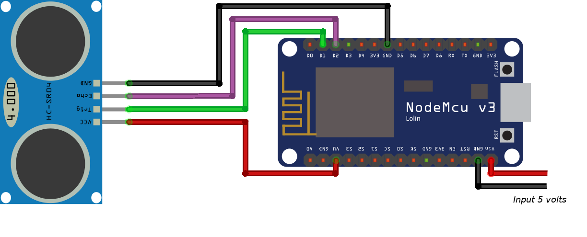

# Indice

- [Sobre](#-sobre)
- [Tecnologias](#Tecnologias)
- [Dispositivos](#Dispositivos)
- [Sketch](#Sketch)
- [Como baixar o projeto](#-como-baixar-o-projeto)

## 🔖&nbsp; Sobre

Projeto desenvolvido para monitorar o volume da caixa d' água. Dividido em 4 subprojetos.

 * Projeto independente mostrando em um visor o volume da água. [Finalizado]
 * Projeto web mostrando em um site instalado internamente no chip o volume da água e estimativa em litros. Funciona apenas na rede local. [Finalizado]
 * Projeto web envia os dados coletados que alimentam uma aplicação ReactJS para apresentar relatórios do momento atual da caixa d' água e o consumo mensal, semanal e diario da mesma. Funciona online.
 * Projeto web envia os dados coletados que alimentam uma aplicação ReactJS e aplicativo para smartphones para apresentar relatórios do momento atual da caixa d' água e o consumo mensal, semanal e diario da mesma.Funciona online.

---
## Tecnologias

Esse projeto foi desenvolvido com as seguintes tecnologias:

- [C](https://isocpp.org/)
- [Arduino IDE](https://www.arduino.cc/)
- [Node.js](https://nodejs.org/en/)
- [React](https://reactjs.org)
- [Firebase](https://firebase.google.com/)
<!-- - [React Native](https://facebook.github.io/react-native/) -->
<!-- - [Expo](https://expo.io/) -->

## Dispositivos

- [NodeMCU]()
- [HC-SR04]()
- [Modulo IC2 Com display LCD]()

## Sketch

---

<h3 align="center" >Vamos nos conectar 😉</h3>

  &ensp;
  &ensp;
  

 

    Desenvolvido 💜 por Filipe Batista 

